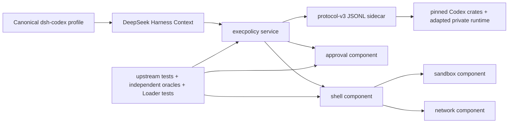

# Architecture

## Why components are split by state ownership

The repository does not divide Codex by convenient source-file size. A
component owns a state machine or observable side effect:

| Component  | Owns                                                                                     | Does not own                                   |
| ---------- | ---------------------------------------------------------------------------------------- | ---------------------------------------------- |
| Execpolicy | config/rule loading, policy evaluation, approval requirement, canonical rule persistence | prompt UI, process launch, sandbox, live proxy |
| Approval   | rich decision wire, prompt correlation, cancellation, live-session grant cache           | policy parsing, command launch, proxy          |
| Shell      | canonical argv/cwd/env, exact approval keys, process/PTY lifecycle, retry choreography   | policy syntax, UI rendering                    |
| Sandbox    | platform enforcement and denial reporting                                                | policy-file persistence, prompt correlation    |
| Network    | managed proxy, host approval cache/coalescing, live mutation and actual-effect result    | generic command cache, prefix parser           |

This prevents a field from being mistaken for an effect. Execpolicy can return
`bypassSandbox: true`; only the shell/sandbox composition can prove that the
command was actually launched with the corresponding Codex behavior.

## Why execpolicy has a Rust sidecar

Codex policy uses Extended Starlark. Shell classification uses tree-sitter,
platform-specific executable discovery, and PowerShell parsing. Rewriting
those semantics in TypeScript would create a second security-decision engine.

The native component therefore:

- directly links public Codex crates at an immutable Git revision;
- adapts only private runtime logic that cannot be linked;
- names modified upstream source in-file;
- exposes a small versioned protocol;
- reports every pinned source identity in `hello`.

TypeScript owns DSH lifecycle, IPC validation, cancellation, process cleanup,
and backpressure. It does not parse policy or reinterpret decisions.

## Execpolicy loading modes

The service exposes three deliberately different inputs:

1. **Host policy:** the pinned public Codex loader discovers user/project/system
   layers, profiles, CLI overrides, and supplied cloud snapshots. Canonical
   startup additionally performs migration and retains the default rule path.
2. **Materialized stack:** a caller supplies exact layers and requirements
   sources; the engine applies pinned ordering, overlay, provenance, and
   fallback semantics.
3. **Flat policy:** explicit ordered files/inline sources for tooling and tests.

Only host policy can persist amendments. Callers never choose an arbitrary
writable policy path.

Online cloud bootstrap is intentionally a separate acquisition seam. The
config service accepts a pinned-shape cloud snapshot but does not authenticate,
fetch, or refresh it.

## DSH packaging

Each installable component lives under `packages/<component>` and is a legal
Cordis plugin or DSH bundle. Native semantic code lives under `crates/`.
Conformance directories mirror behavioral boundaries rather than package
names because one component can require multiple independent upstream oracles.

Generated native binaries are not committed. `pnpm native:stage` verifies a
built sidecar's protocol and provenance, stages it under the package's
platform/architecture directory, and writes a checksum. CI performs the same
staging on each configured runner.

The eventual canonical profile will pin one provider per role and a tested
plugin order. Third-party compositions remain free to replace components, but
their behavior is not silently included in the canonical parity claim.
