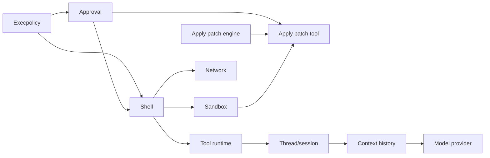

# Component ledger

The target is a DSH-native Codex assembled from exact, independently usable
components. Status applies only to the boundary in each row.

Package layout, state ownership, native protocol, and archive rules are defined
once in [component-package-contract.md](component-package-contract.md); each row
below implements that contract rather than inventing its own repository shape.

| Component             | Primary upstream boundary                                                         | DSH form                                 | Status            | Current evidence / next requirement                                                                                                                                                       |
| --------------------- | --------------------------------------------------------------------------------- | ---------------------------------------- | ----------------- | ----------------------------------------------------------------------------------------------------------------------------------------------------------------------------------------- |
| Execpolicy            | `execpolicy`, `shell-command`, config loader, core exec-policy manager/runtime    | Cordis service + native sidecar + bundle | `parity_verified` | `0.1.0`, macOS arm64 source: runtime 68/68, config stack 6/6, host config 11/11, persistence 16/16; 18 TS/native/Loader tests; archive install and activation in clean DSH rc.6 profile   |
| Approval              | app-server approval wire, core approval store and handlers                        | Cordis service + native protocol sidecar | `parity_verified` | `0.1.0`, macOS arm64 source: upstream/source-pinned comparison 43/43, DSH adapter contracts 10/10, 49 package tests, clean rc.6 archive/profile with stale-token rejection                |
| Shell execution       | unified exec, PTY/process lifecycle, argv/cwd/env identity, retry sequencing      | tool/provider                            | `planned`         | boundary audit completed enough to establish dependencies on execpolicy, approval and sandbox; implementation pending                                                                     |
| Sandbox               | macOS Seatbelt, Linux Landlock/seccomp, Windows restricted token and denial retry | platform providers                       | `planned`         | implementation and platform oracles pending                                                                                                                                               |
| Network               | managed proxy, host decision cache/coalescing, policy actual-effect coordination  | provider/coordinator                     | `planned`         | implementation and proxy E2E pending                                                                                                                                                      |
| Apply patch engine    | parser, streaming/invocation recognition, verification, mutation and delta        | Cordis service + pinned native sidecar   | `parity_verified` | `0.1.0`, macOS arm64 source: 96/96 pinned upstream tests, independent production-path differential 23/23, 10 native and 6 package/Loader tests, clean rc.6 archive/profile mutation check |
| Apply patch tool      | freeform grammar, environment, safety, approval, sandbox retry, hooks/events/diff | canonical tool/provider composition      | `planned`         | blocked on DSH freeform-tool plumbing plus sandbox and TurnDiff components; a JSON `{patch}` function wrapper is explicitly not parity                                                    |
| Instruction discovery | `AGENTS.md` discovery and instruction precedence                                  | context provider                         | `planned`         | boundary audit pending                                                                                                                                                                    |
| Skills                | skill model, loading roots, dependencies and invocation policy                    | provider/loader                          | `planned`         | boundary audit pending                                                                                                                                                                    |
| Plugin manifest       | resource plugin manifest, authority, containment and precedence                   | compatibility provider                   | `planned`         | boundary audit pending                                                                                                                                                                    |
| Tool runtime          | registry, lifecycle, parallelism, cancellation and hooks                          | runtime components                       | `planned`         | boundary audit pending                                                                                                                                                                    |
| MCP and Apps          | catalog precedence, immutable binding, auth and reconnect                         | provider                                 | `planned`         | boundary audit pending                                                                                                                                                                    |
| Context history       | item normalization, call/output invariants and token accounting                   | context manager                          | `planned`         | boundary audit pending                                                                                                                                                                    |
| Compaction            | local/remote compaction, checkpoints and world state                              | context component                        | `planned`         | boundary audit pending                                                                                                                                                                    |
| Thread/session        | thread/turn/item lifecycle, resume/fork/rollback                                  | service/provider                         | `planned`         | boundary audit pending                                                                                                                                                                    |
| Rollout/state         | append-only rollout, thread store and SQLite state                                | storage providers                        | `planned`         | boundary audit pending                                                                                                                                                                    |
| Subagents             | graph, limits, fork sanitation, messaging and permissions                         | collaboration provider/tools             | `planned`         | boundary audit pending                                                                                                                                                                    |
| Memory                | eligibility, claim, extraction, consolidation and recovery                        | memory pipeline                          | `planned`         | boundary audit pending                                                                                                                                                                    |
| Model provider        | Responses protocol, streaming, retry, usage and tool items                        | model adapter                            | `planned`         | boundary audit pending                                                                                                                                                                    |
| Hooks                 | Codex events, transforms and failure semantics                                    | hook provider                            | `planned`         | boundary audit pending                                                                                                                                                                    |
| CLI/TUI               | command surface, rendering and interaction state                                  | application bundle                       | `planned`         | boundary audit pending                                                                                                                                                                    |
| App-server protocol   | thread/turn/item JSON-RPC and generated schemas                                   | optional compatibility surface           | `planned`         | boundary audit pending                                                                                                                                                                    |

## Dependency direction

The arrows mean “is consumed by”, not implementation order. Components remain
installable independently when their boundary makes sense; the canonical
profile supplies the complete graph.

No approximate stock-DSH enforcement is counted as execpolicy completion. The
future shell component must consume `bypassSandbox`, rich approval results and
network effects in one exact launch sequence.

Platform evidence is tracked separately in
[platform-support.md](platform-support.md).
